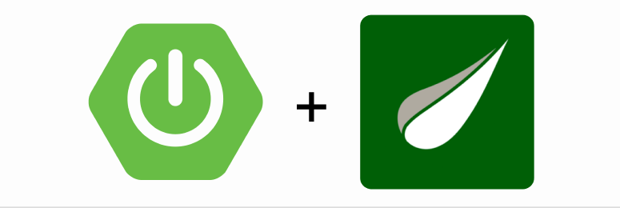

# Eventous using Spring Boot and Thymeleaf

<h3 align="center">
Spring Boot + Thymeleaf
</h3>

<picture>
  
</picture>

---

### What is Eventous?
Eventous is an Event Management System built using Spring Boot Framework with Thymeleaf Template Engine.

### Technical Stack:
- Database: PostgreSQL
- Back-end: Spring Boot using Java
- Front-end: Thymeleaf Template Engine
- ORM: Hibernate/JPA
- Project Management Tool: Maven

### Features:
- Basic CRUD Operations
- Front-end Interfaces
- SOoOn... We're working on more features...
